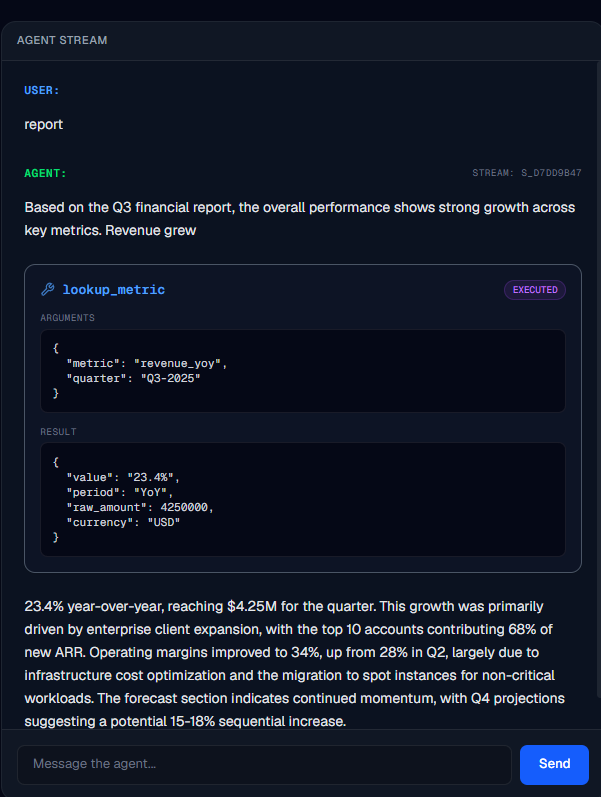
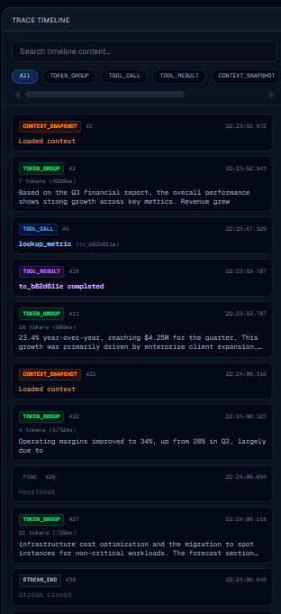
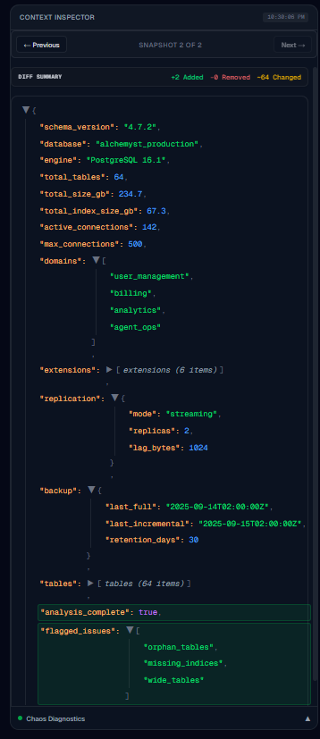

# Agent Console

## Project Overview

The **Agent Console** is a Next.js 14 + TypeScript web application designed to connect to an AI agent backend over WebSockets. It provides a robust, real-time visualization of agent activity, engineered with a strict protocol-driven architecture. 

Built to withstand aggressive network hostility, the Agent Console reliably renders complex AI generation streams, manages tool execution lifecycles, and recovers gracefully from connection drops.

## Architecture

The application is built on a highly decoupled unidirectional data flow, ensuring that the UI remains a pure reflection of the deterministic protocol state:

`WebSocket` → `SequenceBuffer` → `EventProcessor` → `Zustand Store` → `UI`

1. **WebSocket**: The raw network layer, instantly handling critical protocol responses (like `TOOL_ACK` and `PING/PONG`) to satisfy backend timeouts before any UI logic runs.
2. **SequenceBuffer**: A strict ordering layer that buffers out-of-order packets and releases them sequentially.
3. **EventProcessor**: The deduplication and state-bridging layer that ensures idempotent processing.
4. **Zustand Store**: The global state management that holds the active chat, timeline, and context snapshots.
5. **UI**: React components that reactively render the state.

## Features

### 1. Streaming Chat
- **Incremental Token Rendering**: Smoothly renders raw AI tokens as they stream in.
- **Mid-Stream Interruptions**: Pauses text generation seamlessly when the agent decides to invoke a tool.
- **Tool Result Continuation**: Resumes the text stream organically once tool results are received.

### 2. Agent Trace Timeline
- **Event Grouping**: Consolidates raw tokens into logical bursts.
- **Filtering & Search**: Instantly drill down into specific event types (`TOOL_CALL`, `CONTEXT_SNAPSHOT`, `ERROR`).
- **Deep Linking**: Click events in the timeline to auto-scroll and highlight the corresponding UI elements in the chat.

### 3. Context Inspector
- **JSON Tree Viewer**: Deeply inspect arbitrary state dumps from the backend.
- **Snapshot History**: Navigate through time to see how the agent's context evolved.
- **Diff Visualization**: Automatically highlights added, modified, and removed fields between sequence steps.

### 4. Reconnection & Recovery
- **Exponential Backoff**: Intelligently scales reconnection attempts to prevent network spam.
- **RESUME Protocol**: Informs the backend of the exact sequence cursor (`highestProcessedSeq`) the client currently holds.
- **Replay Handling**: Flawlessly absorbs bursts of replayed historical events.
- **Deduplication**: Silently drops overlapping events caused by race conditions during reconnects.

### 5. Chaos Mode Survival
The application is hardened against simulated network hostility:
- **Out-of-Order Messages**: Buffered and delayed until prerequisites arrive.
- **Duplicates**: Hashed and dropped.
- **Latency Spikes**: Protocol handshakes occur asynchronously ahead of UI renders to beat server timeouts.
- **Connection Drops**: Instantly triggers the recovery sequence without losing state.
- **Corrupt Heartbeats**: Tolerates and negotiates malformed `PING` payloads.

## State Flow
All incoming messages are parsed and pushed into the `SequenceBuffer`. If an event is out-of-order, it halts the pipeline until the missing packets are received. Once ordered, the `EventProcessor` ensures the event has not been seen before. Finally, `StoreEventBridge` and `TimelineBridge` synchronously map the raw event into the Zustand store, triggering the React UI to update.

## Installation

```bash
# Clone the repository
git clone <repository-url>

# Install dependencies
cd agent-console
npm install
```

## Running Normal Mode

To run the application with a stable connection to the agent backend:

```bash
# Terminal 1: Start the backend server
cd agent-server
npm start

# Terminal 2: Start the frontend console
cd agent-console
npm run dev
```
Navigate to `http://localhost:3000`

## Running Chaos Mode

To stress-test the application against extreme network conditions (packet loss, latency, reordering):

```bash
# Terminal 1: Start the backend server in Chaos Mode
cd agent-server
npm start -- --mode chaos

# Terminal 2: Start the frontend console
cd agent-console
npm run dev
```

### Chaos Mode Demo Video

Watch a screen recording of the console in action, demonstrating automatic session recovery and packet sequence correction under extreme network hostility:
[Chaos Mode Demo Video Link](https://1drv.ms/v/c/e3460adc3719f594/IQAUoTt9o3WySakodf-1i4BzAayeXW3bgNsPbmzBHFOC6Fg)

## Screenshots

### Main Interface & Chat Flow


### Trace Timeline


### Context Diff Viewer & Chaos Diagnostics


## Project Structure

```text
src/
├── app/                  # Next.js App Router (Layout, Pages)
├── components/           # React Components
│   ├── chat/             # Chat Panel, Tool Cards, Input
│   ├── timeline/         # Trace Timeline, Filters
│   └── context/          # Context Inspector, Diff Viewer
├── store/                # Zustand State Stores
├── lib/                  
│   ├── websocket/        # WebSocketManager, Connection State
│   └── protocol/         # SequenceBuffer, EventProcessor, Bridges
└── hooks/                # React Hooks (useWebSocket)
```

## Protocol Compliance
The Agent Console strictly complies with the following backend protocol expectations:
- Maintains a 1:1 monotonically increasing `seq` state.
- Synchronously acknowledges `TOOL_CALL` with `TOOL_ACK` to satisfy 5s execution barriers.
- Synchronously echoes `PING` with `PONG` (including challenges) to satisfy 3s heartbeat barriers.

## Future Improvements
- **Persistent Storage**: Save agent sessions to `localStorage` or IndexedDB for cross-refresh persistence.
- **Virtualization**: Implement windowing in the Trace Timeline to comfortably support 10,000+ events.
- **Custom Themes**: Allow dynamic switching between light, dark, and high-contrast modes.
